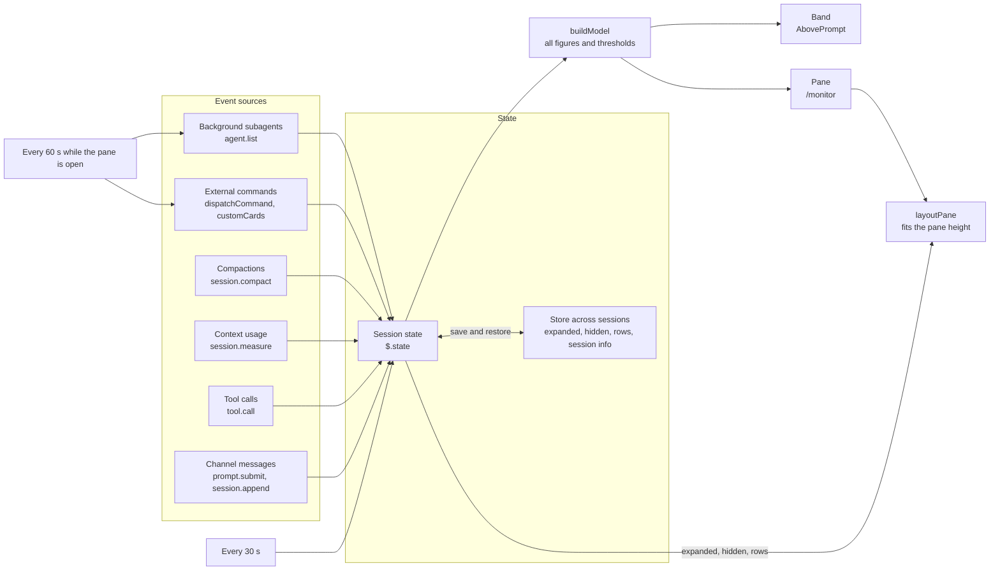

# agent-monitor

A Claude Code mod that shows, at a glance, what your session is doing: channel messages still waiting for a reply, tool calls and subagents in flight and recently ended, how much of each rate limit is used, external dispatches, cards fed by your own commands, and the session itself.

It is a plugin of function hooks with two views: a one-line **band** above the prompt, and a **`/monitor` side pane** made of cards that you can reorder, move to the band or hide with buttons. It only observes; it never changes what the session does.

- [At a glance](#at-a-glance)
- [Requirements](#requirements)
- [Install](#install)
- [Configuration](#configuration)
- [The cards](#the-cards)
- [Arranging cards](#arranging-cards)
- [The `/monitor` command](#the-monitor-command)
- [Quota JSON contract](#quota-json-contract)
- [Custom cards](#custom-cards)
- [Dispatch JSONL contract](#dispatch-jsonl-contract)
- [How it works](#how-it-works)
- [Design notes](#design-notes)
- [Known limits](#known-limits)
- [Troubleshooting](#troubleshooting)
- [Contributing](#contributing)
- [License](#license)

## At a glance

### The band

The band sits above the prompt in every session that loads the mod.

```text
Pane closed:
 ● INBOX 3  discord #general 18m +1ch  │  ● NOW  Bash "build" 12m +1  │  ● restart soon  │  ● QUOTA week 61%  │  no reply yet
Pane open (only what is past a threshold, and cards you placed on the band):
 ● INBOX 3  discord #general 18m +1ch  │  ● NOW  Bash "build" 12m +1  │  ● QUOTA 5h 92% !! resets 17:10
Nothing going on:
 · INBOX 0  │  · NOW idle  │  no reply yet
```

| Segment | Shows |
| --- | --- |
| `INBOX` | Channel messages not answered yet, the oldest one's channel and wait time, and `+Nch` for other channels that are waiting. |
| `NOW` | The oldest tool call or background subagent still running, how long it has run, and `+N` for the others. |
| `restart soon` / `restart now` | Only when context usage passes `contextWarnPercent` / `contextCriticalPercent`. |
| `QUOTA` | The tightest rate-limit window (the highest use among fresh readings): `5h` and `week` are Claude's own, other names come from `quotaCommand`. Past `quotaWarnPercent` it turns yellow with `!`; past `quotaCriticalPercent` red with `!!` and the reset time. Only when there is a reading. |
| placed cards | A card you set to **Band** in [arrange mode](#arranging-cards): its title and its one-line summary. |
| last reply | `no reply yet`, `replied just now` or `replied 4m ago`. |

With the pane closed the band shows every segment. With the pane open it keeps only segments past a threshold (a message waiting too long, an action running too long, a restart warning, a quota past its warning line) plus the cards you placed on the band, and draws nothing at all when there are none, so the two views do not repeat each other.

When the line is too narrow: the quota first shrinks to `Q 61%`; then the last reply goes, then cards placed on the band (last first), then the restart warning, then `NOW`; the quota goes last. `INBOX` always stays.

### The pane

Type `/monitor` to open or close the pane. This sample is plain text printed by the test suite at 60 columns, with neutral sample data; `PROJECTS` is a custom card whose items name a `group`, and `INBOX` and `SESSION` are hidden. More samples, at 60 and 100 columns and in arrange mode, are in [`docs/renders/`](docs/renders/).

```text
╭──────────────────────────────────────────────────────────╮
│ AGENT MONITOR                             Arrange  12:47 │
│ inbox 1 · now 1 · agents 1 · no reply yet                │
╰──────────────────────────────────────────────────────────╯
╭──────────────────────────────────────────────────────────╮
│ - QUOTA                                     tightest 61% │
│ Claude 5h    ██████░░░░   58%   resets 13:51             │
│ Claude week  ██████░░░░   61%   resets Thu 12:00         │
│ Alpha        ░░░░░░░░░░    2%   resets 10/14             │
│ Beta         ░░░░░░░░░░    1%   resets 10/14 1h10m old   │
╰──────────────────────────────────────────────────────────╯
╭──────────────────────────────────────────────────────────╮
│ - RUNNING                                   1 · 2 recent │
│ ● agent review batch 2 fixes                         35m │
│ ─── recent ───────────────────────────────────────────── │
│ ✓ Bash "build web"                            3m · 12:16 │
│ ✗ agent screenshot run                       12m · 12:12 │
╰──────────────────────────────────────────────────────────╯
╭──────────────────────────────────────────────────────────╮
│ - PROJECTS                             5 open · 1 on you │
│ Alpha                                                  3 │
│ ● #301 monitor arrange mode                          you │
│ · #208 parser second pass                             me │
│ · #298 release outline                               ext │
│ Beta                                                   2 │
│ · #150 nightly report cleanup                         me │
│ · #151 export settings page                           me │
╰──────────────────────────────────────────────────────────╯
 hidden: inbox, session
 updated 12:47 · refresh 60s · 2 hidden                Show
```

## Requirements

- Claude Code with function-hook plugins (mods). Tested with **Claude Code 2.1.289**; no older minimum version has been verified.
- The function-hooks API is marked early access by Claude Code and may change between releases.
- Nothing else. The mod has no dependencies and runs inside Claude Code's own hooks environment.

## Install

Clone the repository anywhere, then pick one of these:

1. **One session**: start Claude Code with the folder as a plugin directory.

   ```sh
   claude --plugin-dir /path/to/agent-monitor
   ```

2. **Every session**: name the folder in `CLAUDE_CODE_PLUGIN_DIRS` (absolute paths, `~` allowed, separated by the platform's path-list separator), either in the process environment or in the `env` block of `~/.claude/settings.json`. Each folder is loaded exactly as a `--plugin-dir`.

   ```json
   { "env": { "CLAUDE_CODE_PLUGIN_DIRS": "~/plugins/agent-monitor" } }
   ```

3. **Skills folder**: place the folder at `~/.claude/skills/agent-monitor/`; Claude Code auto-loads it in the next session as `agent-monitor@skills-dir`.

Then type `/monitor`. With the default options the mod runs no external command: you get the band, `INBOX`, `RUNNING` and `SESSION`, and `QUOTA` once Claude Code reports your plan's rate limits. Set `quotaCommand`, `dispatchCommand` or `customCards` to add the other sources and cards.

## Configuration

Options are the plugin's `userConfig` fields. Each one appears as a row in Claude Code's config menu, and is stored in settings under `pluginConfigs`, keyed by the plugin's name (`agent-monitor`, or `agent-monitor@inline`), in its `options` object. A change in the config menu reloads the mod with the new values.

| Option | Default | Description |
| --- | --- | --- |
| `channelNames` | `""` | Display names for channel ids, as `id=name` pairs separated by commas (e.g. `123456=general,987654=ops`). Empty shows `<server> #<last 4 digits of the id>`. |
| `replyTools` | `""` | Comma-separated tool names that count as replying to a channel. Empty means any MCP tool whose name ends in `__reply` or `__voice_reply`, matched to its own server. |
| `waitingAlertMinutes` | `5` | A message waiting this long without a reply turns the inbox to the warning color and shows one toast. Clamped to 0 to 1440. |
| `longActionMinutes` | `10` | A tool call running this long is shown in the warning color. Clamped to 0 to 1440. |
| `contextWarnPercent` | `70` | Context usage at or above this shows `restart soon` and one toast each time it is crossed. Clamped to 1 to 100. |
| `contextCriticalPercent` | `85` | Context usage at or above this shows `restart now` in the error color. Never below `contextWarnPercent`. |
| `dispatchCommand` | `""` | A read-only command that prints dispatch events as JSONL (see [Dispatch JSONL contract](#dispatch-jsonl-contract)). `{since24h}` is replaced with an RFC 3339 time 24 hours ago. Empty hides the `DISPATCHES` card and runs nothing. |
| `dispatchCommandPattern` | `""` | A regular expression; a Bash call whose command matches it is labelled `dispatch -> <runtime>` (runtime taken from `--runtime <x>`), and the dispatches are re-read 5 s after it starts. Empty recognises nothing. |
| `runtimeNames` | `""` | Display names for runtime ids, as `id=name` pairs separated by commas (e.g. `codex-cli=Codex`). Empty shows the runtime id. |
| `timeZone` | `""` | IANA time zone for clock times in the pane (e.g. `Europe/Berlin`). Empty uses UTC. |
| `customCards` | `""` | Extra cards as `TITLE=command` pairs separated by `;;` (see [Custom cards](#custom-cards)). Empty adds no cards. |
| `openOnStart` | `false` | Open the monitor pane when a session starts. |
| `wakePattern` | `""` | A regular expression marking prompts that woke the session (shown in `SESSION`). Empty counts scheduled and loop triggers. |
| `collapsedCards` | `"session"` | Comma-separated card ids collapsed until you expand them: `inbox`, `running`, `dispatches`, `session`, and each custom card's id. |
| `customCardMaxItems` | `5` | Most items an expanded custom card lists; the rest fold into one `+N more` line. Clamped to 1 to 100. |
| `paneMaxRows` | `44` | Rows the pane may use when the surface does not report its height. Clamped to 10 to 500. |
| `quotaCommand` | `""` | A read-only command that prints rate-limit rows as JSON (see [Quota JSON contract](#quota-json-contract)), added to Claude's own windows. Runs every 60 seconds and when the pane opens, pane open or not, because the band shows the quota too. Empty runs nothing and shows Claude's windows only. |
| `quotaWarnPercent` | `70` | A quota window at or above this turns yellow and gets `!`. Clamped to 1 to 100. |
| `quotaCriticalPercent` | `90` | A quota window at or above this turns red and gets `!!`; the band adds its reset time. Never below `quotaWarnPercent`. |
| `recentRows` | `5` | How many ended runs `RUNNING` lists under `recent`. Clamped to 0 to 30. |

Numbers outside their range are clamped rather than rejected. A regular expression that does not compile is matched as plain text instead, so a typo never stops the mod from loading.

Example `~/.claude/settings.json` fragment:

```json
{
  "pluginConfigs": {
    "agent-monitor": {
      "options": {
        "channelNames": "123456=general,987654=ops",
        "timeZone": "Europe/Berlin",
        "openOnStart": true,
        "customCards": "TODO=python3 /path/to/todo.py;;BUILDS=/path/to/builds --json",
        "quotaCommand": "python3 /path/to/quota.py",
        "collapsedCards": "session,builds"
      }
    }
  }
}
```

## The cards

By default cards appear top to bottom in this order; [arrange mode](#arranging-cards) changes the order and where each card goes. The id is the name the `/monitor` command and `collapsedCards` use.

| Card | Id | Default |
| --- | --- | --- |
| header | none | always shown, cannot be hidden or moved |
| `QUOTA` | `quota` | expanded; only when Claude reports its rate limits or `quotaCommand` is set |
| `INBOX` | `inbox` | expanded |
| `RUNNING` | `running` | expanded |
| `DISPATCHES` | `dispatches` | expanded; only when `dispatchCommand` is set |
| custom cards | the title in lower case, other characters as dashes (`WAITING ON YOU` is `waiting-on-you`) | expanded unless listed in `collapsedCards` |
| `SESSION` | `session` | collapsed |

Every card has a title row with a toggle (`-` expanded, `+` collapsed) and a badge on the right. Expanded, it lists its items; collapsed, it keeps one summary row. Where the terminal supports it, the title row is a button that toggles the card.

**Header.** The `Arrange` button and the clock (in `timeZone`), an overview line (`inbox N · now N · agents N` and the time since the last reply) and, past the context warning line, `restart soon` or `restart now`.

**QUOTA.** One row per rate-limit window: Claude's own 5-hour and weekly windows (from Claude Code, the figures its status line shows), then the rows of `quotaCommand`. Each row has a 10-cell gauge (`██████░░░░`, filled cells rounded to the nearest 10%), the percent right-aligned, `!` or `!!` past the thresholds, and when the window resets (`17:10` within a day, `Thu 16:00` within a week, `10/14` after that). Gauges are drawn in the neutral color and change color with the percent only past a threshold. A row read longer ago than twice its source's `maxAgeSeconds` is drawn gray with its age (`1h10m old`) and is never taken as the tightest; a row with no reading says `no data`. The badge is the tightest percent. When `quotaCommand` fails, the card shows `could not read quota: <reason>` above the rows it still has; nothing else changes.

**INBOX.** Messages delivered by any channel server (for example a Discord channel plugin) that have not been answered, one row per channel with the count (`x2`) and the oldest wait time. A message waiting longer than `waitingAlertMinutes` turns the row to the warning color and shows one toast. A reply clears messages when a reply tool succeeds on the same server, and on the same chat when the reply names a `chat_id`; reactions and edits do not count. The same message delivered twice is counted once.

**RUNNING.** Every tool call in flight and every background subagent still running, oldest first, with elapsed time. Labels: Bash shows its description; a Bash call matching `dispatchCommandPattern` shows `dispatch -> <runtime>`; the Agent tool shows `agent <description>`; MCP tools show their short name. Inside a subagent only dispatches are tracked; the rest is covered by the subagent's own row. Anything past `longActionMinutes` turns to the warning color.

Below `recent`, the last `recentRows` Bash calls and subagents that ran at least 10 seconds, newest first, written like the dispatches' recent list: `✓` done, `✗` failed, `–` cancelled, then how long it ran and when it ended (`3m · 15:38`). A background subagent joins the list once Claude Code's subagent list says it ended. Other tools and shorter runs are left out. The list is kept in the mod's store, so a hot reload or a new session keeps it. The badge reads `N · M recent`.

**DISPATCHES.** Work you hand to other agents or tools outside this session, read from `dispatchCommand`. The badge reads `N running · M stalled`. Running dispatches come first (runtime, short id, start time, age, summary); dispatches stalled within the last hour are listed one by one, and older stalled ones fold into one `◌ N stalled since HH:MM` line; below `recent`, the last 3 ended dispatches (change with `/monitor rows dispatches <n>`). A command that fails shows a one-line reason in the card.

**Custom cards.** One card per `customCards` entry, filled from your own command's JSON. The badge is the command's `badge` text when it gives one, else the item count, plus `N failed` in red when any item failed. See [Custom cards](#custom-cards).

**SESSION.** When the session started and how long it has been up, the last wake (time and the first 30 characters of the prompt that woke it), and how many times the conversation was compacted and when. Collapsed, it reads `up 8m · woke never · compacted 0`. These figures survive a hot reload.

**Footer.** `updated HH:MM · refresh 60s` says when the cards' data was last read. When cards are hidden, the line above lists their ids and the footer ends in `N hidden  Show`; `Show` lists each hidden card with its own `Show` button that puts it back.

### Status marks

Both views take their marks and colors from one table, so they always agree.

| Mark | Meaning | Color |
| --- | --- | --- |
| `●` | running, or a severity dot for waiting messages and actions | green; yellow or red past a threshold |
| `◌` | stalled: no end event and no start or heartbeat for 3 minutes | yellow |
| `✓` | done | dim |
| `✗` | failed or rejected | red |
| `–` | cancelled | dim |
| `·` | idle, waiting, or nothing to show | dim |
| `!` / `!!` | a quota past its warning / critical line | yellow / red |
| `█░` | a quota gauge: used / left | neutral; yellow or red past a threshold; dim when stale |
| `↑ ↓` | move a card up or down (arrange mode) | |

## Arranging cards

Press `Arrange` in the header to rearrange the pane without typing commands; press `Done` to go back. While arranging, each card shows only its title row, with four buttons (a sample at 60 columns, where they shrink to `↑ ↓ B H`; `QUOTA`, the first card, holds the letter keys until the focus ring moves):

```text
╭──────────────────────────────────────────────────────────╮
│ AGENT MONITOR                                Done  12:47 │
│ Arrange: move, place or hide cards. Changes are kept.    │
│ Each change is saved at once; Done only leaves.          │
│ Pick a card: Tab or arrow keys, or click. Keys u d b h.  │
│ ↑ ↓ move · B/P band or pane · H hide                     │
╰──────────────────────────────────────────────────────────╯
╭──────────────────────────────────────────────────────────╮
│  QUOTA                                    d: ↓ b: B h: H │
│  RUNNING                                         ↑ ↓ B H │
│  PROJECTS                                        ↑   B H │
╰──────────────────────────────────────────────────────────╯
 hidden: inbox, session
 updated 12:47 · refresh 60s · 2 hidden                Show
```

| Button | Effect |
| --- | --- |
| `↑` / `↓` | Move the card one place up or down among the cards not hidden. The first card has no `↑` and the last no `↓`. |
| `Band` / `Pane` | Show the card as a segment of the band (its title and one-line summary) instead of in the pane, or bring it back. Cards on the band are marked `(band)` here and stay on the band even with the pane open. |
| `Hide` | Take the card off the pane and the band. It is listed in the footer, where `Show` brings it back. Hiding `QUOTA` also removes the quota from the band. |

Under the header, arrange mode says how it works: each change is saved the moment you press a button (`Done` only leaves arrange mode, it does not save), and how to pick a card. Below 80 columns it adds a legend for the shortened buttons: `↑ ↓ move · B/P band or pane · H hide`. More samples: [the hidden list shown](docs/renders/pane-hidden-60.txt), [a card moved from the band back to the pane](docs/renders/pane-arrange-band-to-pane-60.txt), and [the focus on another card](docs/renders/pane-arrange-focus-60.txt).

The order, the placement and the hidden cards are kept in the mod's store, so the next session starts the way you left it; `/monitor hide` and `/monitor show` work on the same hidden list. Below 80 columns the buttons shrink to `↑ ↓ B H`; a long card title is cut before any button is.

**Keys.** When the pane has the keyboard (a click on it, or Claude Code's focus key), Tab and the arrow keys move the focus ring between buttons and Enter presses the one it is on. The card the ring is on also takes four letter keys, shown before its buttons: `u` up, `d` down, `b` band or pane, `h` hide. Until the ring moves, the first card has them. Claude Code keeps Escape to return the keyboard to the prompt, so it does not leave arrange mode: press `Done`.

## The `/monitor` command

| Command | Effect |
| --- | --- |
| `/monitor` | Open or close the pane. |
| `/monitor expand <card\|all>` | Show the card's items. |
| `/monitor collapse <card\|all>` | Shrink the card to its title and one summary row. |
| `/monitor hide <card>` | Remove the card from the pane, one card at a time; hidden ids are listed above the footer. `hide all` is refused and the header always stays. |
| `/monitor show <card\|all>` | Put hidden cards back. |
| `/monitor rows <card> <1-30\|default>` | How many items the expanded card lists before `+N more`; for `dispatches` and `running`, how many recently ended runs are listed. `default` restores the configured value. |

Card names are forgiving:

- Case does not matter, and spaces stand for dashes: `/monitor rows Waiting On You 8` works.
- A unique prefix is enough: `/monitor rows wait 6`, `/monitor expand sch`.
- An ambiguous prefix lists the candidates: `"s" matches schedule, session; type more of the name.`
- A typo lists every card and suggests the nearest one: `No card named "dispach". Did you mean dispatches? Cards: inbox, running, dispatches, ...`

Expanded, hidden and row settings (and the order and placement set in arrange mode) are kept in the mod's store, so the next session starts the way you left it. The command's argument hint lists every subcommand and every card id for the current configuration.

## Quota JSON contract

`quotaCommand` runs without a shell, with a 10 second timeout, every 60 seconds and when the pane opens. It prints one JSON object with a `rows` list (a bare list is accepted too), at most 12 rows:

```json
{
  "rows": [
    { "name": "Alpha", "usedPercent": 42, "resetsAt": "2026-10-14T02:37:11Z", "fetchedAt": "2026-10-07T08:50:52Z", "maxAgeSeconds": 300 },
    { "name": "Beta", "usedPercent": null, "resetsAt": "", "fetchedAt": "", "maxAgeSeconds": 1800 }
  ]
}
```

- `name`: required, cut to 20 characters.
- `usedPercent`: 0 to 100 (more past an exceeded limit), or `null` when the source has no reading; the row then says `no data`.
- `resetsAt`: when the window resets, an ISO 8601 time, or empty.
- `fetchedAt`: when the source read the figure, an ISO 8601 time, or empty when unknown.
- `maxAgeSeconds`: optional, how often the source is refreshed. A row whose `fetchedAt` is more than twice this long ago (or unknown) is stale: drawn gray with its age, and never taken as the tightest. Without it, a row is never stale.
- A row that breaks these rules fails the whole read, with its reason (`row 2 usedPercent is not a number`), rather than showing half of what the command meant. A failing read keeps the last good rows, which turn stale on their own.

Claude's own windows need no command: the mod reads them from Claude Code (`$.session.usage()` and the `session.measure` event) as `Claude 5h` and `Claude week`, and adds the command's rows below them. A good `quotaCommand` only reads what something else already fetched (a cache file, for example); querying a service on every call can cost quota itself.

## Custom cards

`customCards` holds `TITLE=command` pairs separated by `;;`, for example `TODO=python3 /path/to/todo.py;;BUILDS=/path/to/builds --json`. Each command is split into arguments like a shell would for plain words and quotes, but **runs without a shell** (no pipes, globbing or variable expansion; wrap anything more in a script), with a 10 second timeout, when the pane opens and every 60 seconds while it is open. It must print one JSON object:

```json
{
  "summary": "one line, shown when the card is collapsed",
  "badge": "optional, shown on the title row in place of the item count",
  "items": [
    { "mark": "waiting", "text": "approve the weekly release notes", "right": "4d" },
    { "mark": "failed", "text": "disk-usage-check-daily", "right": "last 05:30" },
    { "mark": "warn", "text": "#41 release checklist", "right": "you", "group": "Alpha" }
  ],
  "empty": "text shown when there are no items"
}
```

- `mark` is one of `running`, `stalled`, `done`, `failed`, `idle`, `waiting`, `warn`; anything else shows as `idle`.
- `text` and `summary` are cut to 80 characters, `right` to 12, `empty` to 60. At most 30 items are read.
- `badge` is optional: short text (cut to 30 characters) shown on the title row instead of the item count, for example `14 open · 3 on you`. It is yellow when an item is `waiting` or `warn`, like the count; failed items still add `N failed` in red. Without it the title row shows the item count.
- `group` is optional. When items name a group, the card draws a gray heading per group, in the order the groups first appear, with the group's item count on the right, and lists the group's items under it; items with no group come first, under no heading. Headings do not count against the item limit. Cards whose items name no group are drawn as before.
- When a card shows fewer items than it has, `failed`, `warn` and `stalled` items are listed first; the rest keep the command's order.
- Text is shown as given, in any language; the mod does not translate it.
- Output that is not a JSON object, or a command that fails or times out, shows `could not read: <reason>` in the card; nothing throws.

## Dispatch JSONL contract

`dispatchCommand` runs without a shell, with a 20 second timeout, when the pane opens, every 60 seconds while it is open, 5 seconds after a Bash call matching `dispatchCommandPattern` starts, and again when that call ends. It prints one JSON object per line:

```json
{"event_type":"DispatchStarted","timestamp":"2026-10-05T03:46:00Z","payload":{"dispatch_id":"a1b2c3d4-0001","runtime_id":"alpha-cli","task_id":"T-108 parser"}}
{"event_type":"DispatchHeartbeat","timestamp":"2026-10-05T04:00:00Z","payload":{"dispatch_id":"a1b2c3d4-0001"}}
{"event_type":"DispatchCompleted","timestamp":"2026-10-05T04:05:00Z","payload":{"dispatch_id":"a1b2c3d4-0001"}}
```

- `event_type`: `DispatchStarted`, `DispatchHeartbeat`, `DispatchCompleted`, `DispatchFailed`, `DispatchCancelled` or `DispatchRejected`.
- `timestamp`: RFC 3339.
- `payload.dispatch_id`: required; events are paired by it, and its first 8 characters are shown.
- `payload.runtime_id` (or `payload.runtime`): optional, mapped through `runtimeNames`.
- The summary is the first of `prompt_summary`, `summary`, `title`, `task_name`, `task`, `task_id` that has a value, cut to 30 characters.
- Other fields are ignored. One unreadable line fails the whole read (shown as a one-line reason) rather than pairing half of it; output too large to read whole is a failure too.
- An end event decides the state. With no end event, a dispatch whose last start or heartbeat is more than 3 minutes old is **stalled**; send a heartbeat more often than that (for example every 30 seconds) while work is running.

## How it works

### One model, two views

Every figure and every threshold is computed once, in `buildModel()` (`hooks/model.ts`). The band (`hooks/view.ts`) and the pane (`hooks/pane.ts`) only lay that model out, and both take marks and colors from the same table, so their numbers and symbols cannot disagree. A test feeds one input to both and compares them.



### Observe only

The mod hooks these events. Apart from `/monitor` and its own two drawings, every hook passes the event on unchanged with `next(e)`; it never blocks, rewrites or answers a tool call or a prompt. Its own errors go to the debug log, so a failure inside the mod never reaches your session.

| Event | What the mod does |
| --- | --- |
| `session.start` | Clears the in-flight list, restores stored settings and the recent list, reads Claude's rate limits, registers `/monitor`, starts the timers, and opens the pane when `openOnStart` is set. |
| `prompt.submit`, `session.append` | Records channel messages from their `<channel ...>` tags, each message once; marks prompts that woke the session. |
| `tool.call` | Wraps each call: registers it at the start and removes it at the end; after a successful reply tool, clears that channel's messages and notes the reply time; re-reads dispatches around a dispatch command. |
| `session.compact` | Counts compactions of the main conversation (precomputed and skipped ones do not count). |
| `session.measure` | Reads context usage for the restart warning, with one toast each time the warning line is crossed, and Claude's rate-limit windows when they moved. |
| `ui.focus` | Notes which card's arrange button the focus ring is on, so that card takes the `u`/`d`/`b`/`h` keys. |
| `command.run` | Answers `/monitor` and its subcommands. |
| `ui.close` | Redraws the band when the pane closes, so it returns to its full form. |
| `ui.render` | Draws the band (`AbovePrompt`) and the pane (`Pane`). |

### Refresh and timing

- A 30 second tick updates elapsed times and checks the waiting threshold.
- While the pane is open, `dispatchCommand`, the custom card commands and the subagent list are read when it opens and every 60 seconds. With the pane closed, none of these run.
- `quotaCommand` and Claude's rate limits are read every 60 seconds whether the pane is open or not, because the band shows the quota too.
- A refresh that has not finished after 45 seconds no longer blocks the next one, so one hung command cannot freeze the pane.
- The footer shows when the data was last read. After 150 seconds without a successful read (two missed refreshes), it turns to the warning color and says how old the data is: `updated 12:02 (stale, 4m old) · refresh 60s`.

### Fitting the pane height

The pane uses the height the terminal reports, or `paneMaxRows` when it reports none. Collapsed cards always take their title and one summary row. When the cards do not fit, the longest expanded card is shortened one row at a time (down to a single `+N more` row) until everything fits; only then is the footer dropped. As long as the height leaves room for each card's frame and title, every card title stays on screen (tested at 30 and 44 rows).

## Design notes

- **Context usage is left to Claude Code's status line.** Claude Code already shows context usage. Showing the same percentage again in the band and the pane only repeated one number in several places, so the mod shows a context figure only when it calls for action: `restart soon` past `contextWarnPercent`, `restart now` past `contextCriticalPercent`.
- **A glyph whitelist.** Some terminal fonts cannot draw every Unicode symbol and show a box instead (thin gauge blocks such as `▰▱` and refresh arrows are common offenders). Every non-ASCII character either view may draw is in one whitelist, `●✓✗◌–·│─┊╭╮╰╯█░↑↓`, and a test scans every drawn line against it; the gauge blocks `█░` and the arrows `↑↓` are in the Windows console's code page 437 too. Card toggles are the ASCII `+` and `-`, quota flags the ASCII `!` and `!!`. The mod's own text is ASCII; only text from your channels or commands may contain other characters.
- **No external commands by default.** Only `quotaCommand`, `dispatchCommand` and `customCards` run anything. All are empty by default and run without a shell, with a timeout; the last two only while the pane is open. A fresh install observes and draws; it does not execute.
- **Quiet until it needs you.** Gauges and percents stay in the neutral color below the warning line; color, `!` and `!!` appear only past a threshold, and stale readings are gray rather than passed off as current.
- **Arrange mode, apart.** The everyday title row has only the collapse toggle; the move, place and hide buttons appear only in arrange mode, so they never take width in a narrow pane or get pressed by mistake.
- **One model, two views.** Figures are computed in one place, so the band and the pane never disagree.
- **Built for narrow panes.** Tested at 48, 60 and 100 columns without overflow (arrange mode included), and within 44 rows with every card title visible.

## Known limits

- Dispatches are read for the last 24 hours only.
- Stalled means no heartbeat for 3 minutes; a dispatch system that stops sending heartbeats while work still runs will show as stalled.
- Background subagents are only as current as Claude Code's subagent list, read when the pane refreshes.
- The waiting threshold can change color up to 30 seconds late; dispatch and custom card data can be up to 60 seconds old.
- A hot reload or a new session clears the in-flight list; actions that started before the reload are not shown in `RUNNING`. The `recent` list is kept.
- `recent` lists Bash calls and subagents of at least 10 seconds only. A background subagent's end time is when the mod saw it ended (the next pane refresh), not the exact moment.
- Claude's quota windows appear only on a subscription that reports them; with an API key there are none.
- In arrange mode, Escape returns the keyboard to the prompt (Claude Code keeps that key); `Done` leaves arrange mode.

## Troubleshooting

**The pane does not appear.** A pane you open with `/monitor` is seated at any terminal width. A pane opened unasked, by `openOnStart`, is seated only once the terminal is at least 144 columns wide, and waits until then; widen the terminal or type `/monitor`.

**I see two bands.** Check whether the mod is loaded twice, for example from both a `--plugin-dir` folder and `CLAUDE_CODE_PLUGIN_DIRS` or the skills folder. Load one copy.

**The footer says `stale`.** The cards' data has not been read successfully for over 150 seconds, usually because `dispatchCommand` or a custom card command hangs or keeps failing. Run the command yourself and check that it prints its JSON within the timeout (20 s for dispatches, 10 s for custom cards).

**`QUOTA` says `could not read quota: ...`, or a row is gray with `old`.** The first is `quotaCommand` failing (run it yourself and check its JSON against the [contract](#quota-json-contract)); the second is a reading older than twice its `maxAgeSeconds`, which means whatever feeds the command has stopped refreshing.

**A card says `could not read: ...`.** The command failed, timed out, or printed something other than the expected JSON. The reason after `could not read:` is the first line of the error. Remember the command runs without a shell: pipes and `$VARS` are passed literally.

**`DISPATCHES` does not appear.** It is shown only when `dispatchCommand` is set. If it shows everything as stalled, check that your events carry `payload.dispatch_id` and that heartbeats arrive more often than every 3 minutes.

**Messages stay in `INBOX` after I replied.** By default only MCP tools whose names end in `__reply` or `__voice_reply` count as replies, on the same server as the message. List your reply tools in `replyTools` if they are named otherwise.

**Hook errors.** The mod logs its own errors to the debug log (`claude --debug`) as `agent-monitor <where>: <reason>`.

## Contributing

Issues and pull requests are welcome. Keep changes in line with the design notes: observe only, no external commands unless configured, ASCII text plus the glyph whitelist.

```sh
claude plugin validate .                         # manifest and hooks module, as the engine reads them
claude plugin test .                             # runs tests/*.test.ts against the engine
npx -y -p typescript@5.9.3 tsc -p . --noEmit     # type check
```

`claude plugin test` also prints sample panes at 48, 60 and 100 columns, which is the quickest way to see a layout change. `scripts/write-renders.sh` runs the suite and writes the band and pane samples (normal and arrange mode, 60 and 100 columns) to `docs/renders/`; run it after a layout change and commit the result.

The type declarations the hooks import (`claude-code`, `claude-code/testing`) are written by Claude Code into `.claude-plugin/types/` the first time it loads the mod from a folder you own (for example with `claude --plugin-dir .`), and again after an update. That folder is not committed; load the mod once before running `tsc`. `tsconfig.json` already includes it.

Code that calls `$` stays in `hooks/register.tsx`: Claude Code follows `$` only into functions declared in the same file as the hook, so the other modules are pure helpers.

Every behavior change needs a test. The suites cover the band, the pane, card arrangement and arrange mode, the quota, recent runs, dispatch parsing and the pure logic; `tests/kit.ts` holds the shared engine stand-ins and a plain-text renderer.

Layout:

```text
.claude-plugin/plugin.json   manifest and userConfig options
hooks/hooks.json             names the hooks module
hooks/register.tsx           the hooks: events, timers, /monitor
hooks/config.ts              option parsing and card name matching
hooks/model.ts               the one model both views read
hooks/view.ts                the band and the shared mark table
hooks/pane.ts                the pane's cards and height fitting
hooks/dispatch.ts            dispatch JSONL parsing and pairing
hooks/custom.ts              custom card JSON parsing
hooks/quota.ts               quota JSON parsing, Claude's windows, gauges and reset times
hooks/arrange.ts             card ids, moving a card, reading the stored order and placement
hooks/recent.ts              which ended runs are kept, and background subagents that ended
hooks/logic.ts               channel, reply and subagent tracking
types/index.d.ts             the mod's state contract
tests/                       claude plugin test suites
scripts/write-renders.sh     writes the plain-text samples to docs/renders/
docs/renders/                band and pane samples at 60 and 100 columns
```

## License

MIT. See [LICENSE](LICENSE).
